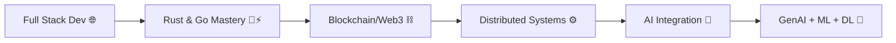

# Hi there, I'm Krishna! 👋

<div align="center">
  
</div>

---

## 🦀 About Me

```rust
struct Developer {
    name: "Krishna Sarone",
    role: "Full Stack + Systems Developer",
    languages: ["Go", "Rust", "JavaScript", "TypeScript", "C++"],
    focus: ["System Design", "AI/ML", "Web3"],
    fun_fact: "Code is poetry written in logic 💻"
}
```

- 🔭 Currently building scalable systems with Rust + Docker
- 🌱 Exploring GenAI, Machine Learning & Deep Learning
- 💡 Love writing efficient, performance-driven code
- 🎯 Goal: Build products that solve real-world challenges
- ⚡ Fun fact: I'm obsessed with optimizing everything 🚀

## ⚡ Tech Stack in Motion

<p align="center">
  
</p>

## 📂 Featured Projects

- 🚕 **Uber Clone (MERN)** → Real-time ride-hailing simulation
- 💻 **Online IDE (MERN + Docker + WebSocket)** → Cloud IDE with real-time code execution
- 📄 **Resume Craft (Rust + React + MongoDB + Docker)** → Resume builder & optimizer

## 📊 GitHub Analytics

<p align="center">
  
  
</p>

<p align="center">
  
</p>

<p align="center">
  
</p>


## 📖 Current Learning Path



## 🤝 Let's Connect!

<div align="center">
  <!-- Example: -->
  <a href="https://www.linkedin.com/in/krishnasarone/"></a> 
  <a href="https://x.com/KrishnaSarone"></a>
</div>

<div align="center">
  
</div>

<div align="center">
  
</div>
