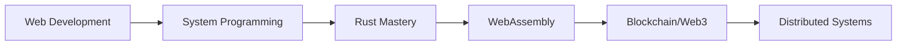

# Hi there, I'm Krishna! 👋

<div align="center">
  
</div>

---

## 🚀 About Me

```rust
struct Developer {
    name: String,
    role: String,
    current_focus: Vec<String>,
    interests: Vec<String>,
    location: String,
}

let krisn = Developer {
    name: "Krishna Sarone".to_string(),
    role: "Full Stack Developer".to_string(),
    current_focus: vec!["Rust".to_string(), "Web3".to_string(), "System Design".to_string()],
    interests: vec!["Open Source".to_string(), "Performance".to_string(), "Innovation".to_string()],
    location: "India".to_string(),
};
```

- 🔭 Currently diving deep into **Rust** and systems programming
- 🌱 Exploring **WebAssembly**, **Blockchain**, and **Cloud Architecture**
- 💡 Passionate about writing clean, efficient code and solving complex problems
- 🎯 Goal: Contributing to impactful open-source projects
- ⚡ Fun fact: I love optimizing code performance and learning new paradigms

---

## 🛠️ Tech Arsenal

<div align="center">

### Languages


### Frontend


### Backend & Databases


### Tools & DevOps


</div>

---

## 📊 GitHub Analytics

<div align="center">
  
  
</div>

<div align="center">
  
</div>

---

## 🏆 GitHub Trophies

<div align="center">
  
</div>

---

## 🌟 Current Learning Path



---

## 🤝 Let's Connect!

<div align="center">

[](https://www.linkedin.com/in/krishna-sarone-89b819297/)
[](https://instagram.com/krisn_2_)
[](https://github.com/krisn2)

</div>

---

<div align="center">
  
</div>

<div align="center">
  <i>💻 "Code is poetry written in logic" 💻</i>
</div>

---

⭐ **If you find my work interesting, don't forget to star my repositories!** ⭐
